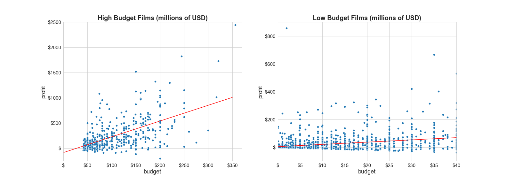
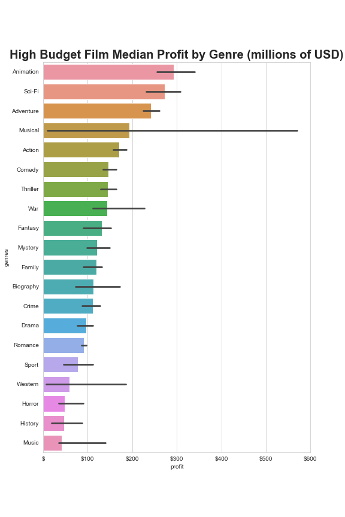
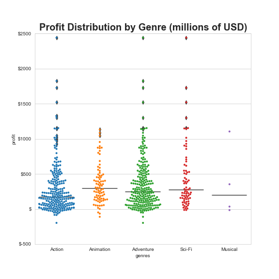
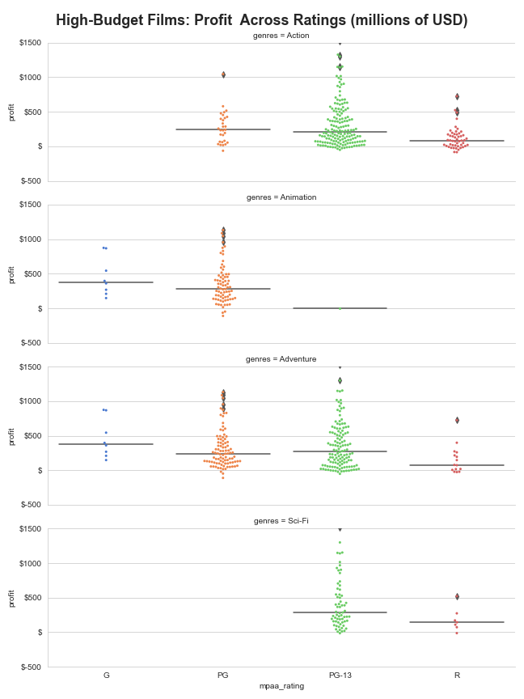

# Microsoft Studios Film Profit Analysis

**Author**: Morgan Didjurgis

## Overview

This project's purpose is to provide recommendations on what type of films perform the best for Microsoft, since they are opening a new movie studio. Analysis of almost 2000 movies made in the US in the last 10 years shows that higher budget films (over $40 million) tend to have higher profits. Among higher budget films, those with certain genres, MPAA ratings, and release months tend to perform better on average. 

## Business Problem

Microsoft is seeking recommendations for which type of films they can make in order to have the best chance at maximizing profit. While films are generally risky business ventures, this risk can be reduced by choosing budget sizes, genres, MPAA ratings, and release months that have been shown to have higher success rates. 

This project will evaluate:

1) Is budget size correlated with profit?

2) Which genres tend to perform the best?

3) Which MPAA ratings tend to perform the best? I'll also examine which MPAA ratings perform the best within the most profitable genres, since this can be very specific to the type of movie.

4) Do certain release months tend to have higher profits? Does this vary by genre?


## Data

The data for this project came from multiple online movie databases.  The primary source was the IMDB (Internet Movie Database) API with some additional data gathered from Box Office Mojo and TMDB (The Movie Database).

The main variables I intend to use for analysis are worldwide gross, budget, MPAA rating, genre, and release month. Worldwide gross and budget will be used to calculate profit. Budget, MPAA rating, genre, and release month will be used to determine which film characteristics tend to lead to higher profit. MPAA rating, genre, and release month are all categorical, which I will have to keep in mind during the analysis.

## Methods

This project uses descriptive analysis. Linear correlation was used to look at budget and profit. To examine how profit is related to categorical variables, the mean, median, and profit distribution were used. Seaborn was used extensively for calculations and distribution plots and statsmodels was used for simple linear regression.

## Results

High-budget films, defined as over $40 million for this project, are more positively correlated with profit than low budget films. The correlation coefficient for high-budget is 3.12, while for low-budget it is 1.62.  The fit is not incredibly strong, with an R-squared value of .33, but it still shows a greater propensity for higher budget films to produce higher profits. Microsoft can afford to produce high-budget films and therefore should focus on productions costing over $40 million.



Among high-budget films, Animation, Action, Adventure, Sci-Fi, and Musicals have the highest median profits.



There were very few Musicals in the high-budget category as shown in the plot below. There is not enough data on this genre to make a good recommendation to Microsoft so it will be excluded from further analysis. The other four genres have right-skewed profit distributions with a number of very high profit outliers.



For the top four high-budget genres, PG-13 is the recommended MPAA rating to increase profits except for Animation, which is PG. While G actually had a slightly higher median than PG, there were far fewer movies with this rating so PG is a better recommendation. Similarly, I will recommend PG-13 for Action movies even though the median profit for PG is slightly higher.



When examined across release months, the median profit peaks in late Spring/Early Summer (April-July) and the holiday season (November/December). This was examined broken down by genre as well, but most genres showed a similar pattern.


While this data was not a comprehensive list of all movies made in the US in the last 10 years, it did include most of the large studio movies that would be comparable to what Microsoft would make.  Many of the films that were filtered out due to missing data had smaller or unknown budgets and would not have been a part of the high budget group.  Therefore, I am reasonably confident that this dataset provided sound information about film performance for Microsoft's purposes.

It is important to note that this was a descriptive analysis based on correlation of certain characteristics with profit. It did not establish clear causation between those characteristics and increased profit. Many films with the recommended characteristics still perform poorly and the quality of the film produced is still important. However, making high-budget films in these categories can give the studio a better chance at success.


## Conclusions

This analysis led to four recommendations for determining what type of films to produce.

1) High budget films (defined as over $40 million in this project) are more positively correlated with profit than low budget films. Since Microsoft is a large company with ample capital, they should invest in higher budget productions.

2) Among high budget films, those which can be classified as Animation, Action, Adventure, or Sci-Fi have higher profits on average. Microsoft should consider making films that fall into one or more of these genres.

3) High-performing MPAA Ratings vary by genre, although overall R-Rated movies tend to have lower profits. Below is a breakdown of recommended MPAA rating for the top four genres:<br>
>-Animation: PG<br>
>-Action: PG-13<br>
>-Adventure: PG-13<br>
>-Sci-Fi: PG-13
    
4) For high-budget films, profits tend to be higher in late Spring and early Summer (April-July) and in the holiday months (November and December). The month with the highest median profit is May, although this varies slightly by genre. Release dates in either of these peak seasons could give a high-budget film a better chance for success.


### Next Steps

More advanced methods could be utilized to create a predictive model for profit. Work has been done on machine learning models that can predict box office income based on characteristics of the film. There are also models that can predict outcomes from a script by using natural language processing to evaluate the storyline, genre, and type of language used. This could allow Microsoft to narrow down profitable films to produce within the overarching categories recommended by this project.


## For More Information

Please review our full analysis in [our Jupyter Notebook](./student.ipynb) or our [presentation](./DS_Project_Presentation.pdf).

For any additional questions, please contact **Morgan Didjurgis at morgan.didjurgis@gmail.com**

## Repository Structure

```
├── README.md                           <- The top-level README for reviewers of this project
├── student.ipynb                       <- Narrative documentation of analysis in Jupyter notebook
├── api_calls.ipynb                     <- Narrative documentation of data collection
├── DS_Project_Presentation.pdf         <- PDF version of project presentation
├── data                                <- Both sourced externally and generated from code
└── images                              <- Both sourced externally and generated from code
```
